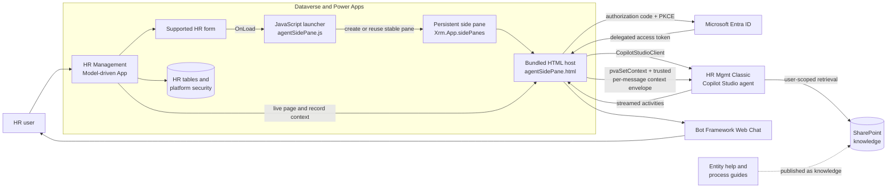
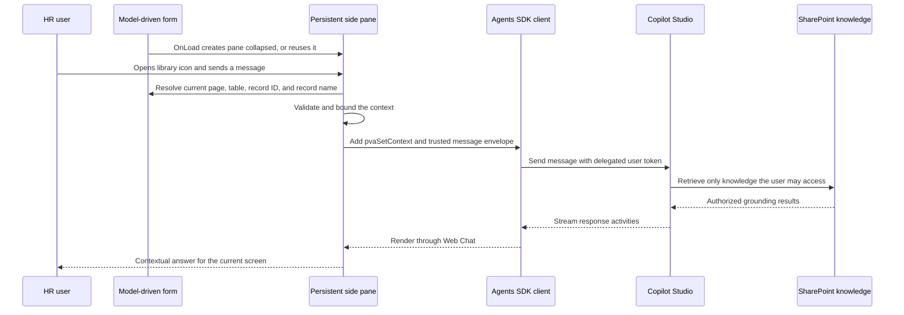

# Agent Sidecar Platform

Agent Sidecar Platform adds app-keyed contextual Copilot Studio assistants to Dataverse Model-driven Apps. The proven **HR Management** sidecar remains the deployed reference runtime; the React Code App in [src](src) is now the reusable **Agent Sidecar Administration** experience.

The accepted product architecture uses a managed **Agent Sidecar Core**, one **Target Binding** solution per Model-driven App, and multiple sidecars keyed by app ID in one environment. Administration is a Power Apps Code App restricted to System Administrators. The administration schema and generated Dataverse clients are now connected; the Code App itself has not been deployed.

## 🚀 Deploy to a new environment — start here

Everything you need to stand up the sidecar in your own environment is in two places:

1. **📖 Interactive setup guide** — open [`docs/setup-guide/AgentSidecarSetupGuide.html`](docs/setup-guide/AgentSidecarSetupGuide.html) in your browser. It is a complete, click-by-click walkthrough (Azure app registration → Copilot Studio agent → solution import → connections → in-app wizard) with a live values worksheet that fills your own IDs into every command and field, each with a one-click **Copy** button.

   > Tip: after cloning, double-click the file or run `open docs/setup-guide/AgentSidecarSetupGuide.html` (macOS) / `start docs/setup-guide/AgentSidecarSetupGuide.html` (Windows).

2. **📦 Unmanaged solution package** — import [`solution-core/AgentSidecarCore.zip`](solution-core/AgentSidecarCore.zip). This is the reusable, HR-free **Agent Sidecar Core** solution and includes the Code App, tables, option sets, web resources, Token Broker plugin, and the Direct Line token Custom API.

## Sidecar administration

The Code App provides:

- A portfolio dashboard with current health and lifecycle state.
- A five-step flow for selecting a Model-driven App, enabling tables, resolving an existing Copilot Studio agent, configuring public-client identity and pane settings, and reviewing deployment impact.
- Automatic Health Validation when a configuration opens.
- Explicit Configuration Drift review and approved reconciliation.
- Disable/re-enable, automatic rollback messaging, blocking rollback-failure remediation, and dependency-aware scoped uninstall.
- A single provider composition seam: mock lifecycle behavior for local development and generated Dataverse services in the Power Apps host.
- Responsive Fluent UI v9 layouts and `HashRouter` routing for the Power Apps host.
- Dataverse-backed app, form, agent, solution, role, configuration, and binding discovery.
- Idempotent form-handler deployment, semantic handler adoption, generated `PublishXml` and `AddSolutionComponent` operations, canonical read-back fingerprints, scoped rollback, and solution ownership checks.

Run the mock experience locally with `npm run dev:local`. Validate it with `npm run typecheck`, `npm run lint`, `npm run test`, `npm run test:e2e`, and `npm run build`. Connected read-only host validation is the next runtime gate. Do not run `npm run deploy` without explicit approval for the live environment.

## What the solution provides

- A Dataverse HR data model for benefits, time off, and expenses.
- Reuse of platform tables for Employee (`systemuser`), Position (`position`), and Department (`businessunit`).
- A persistent, collapsed **HR Management App Guide** side pane on seven HR forms.
- Delegated Microsoft Entra authentication using authorization code with PKCE.
- A connection to the existing **HR Mgmt Classic** Copilot Studio agent through the Microsoft 365 Agents SDK.
- Live page context that updates before every user message without restarting the conversation.
- Screen-specific and process-level HR knowledge documents for contextual grounding.
- A **New conversation** action that resets the transcript while retaining the signed-in identity and current page context.
- A theme-aware library icon shared by the side-pane switcher.
- An unpacked, source-controlled Dataverse solution that includes the app, tables, forms, views, choices, web resources, and temporary rollback components.

## Architecture



### Runtime message flow



## How the components fit together

| Component | Responsibility |
|---|---|
| **HR Management Model-driven App** | Provides the navigation shell, Dataverse forms, authenticated Power Platform session, and current page context. The existing app is reused rather than recreated. |
| **Supported form OnLoad handlers** | Call `HRAgentSidecar.initializeGuide` with the execution context. The handler is registered on Benefit Plan, Benefit Enrollment, Expense Line, Expense Report, Time Off Balance, Time Off Request, and Time Off Type main forms. |
| **JavaScript launcher** | Validates the current entity and record identifier, creates or reuses one stable pane, and navigates it to the HTML web resource only on first creation. See [model-driven/webresources/maftagsc_/copilot/agentSidePane.js](model-driven/webresources/maftagsc_/copilot/agentSidePane.js). |
| **Persistent side pane** | Uses pane ID `maftagsc_hr_management_app_guide`, width 420, `canClose: false`, `isSelected: false`, and `alwaysRender: true`. It starts collapsed and preserves the active conversation during navigation. |
| **HTML host and TypeScript client** | Hosts Web Chat, acquires a delegated token, creates the Agents SDK connection, refreshes context, and manages conversation reset. The maintained source is [model-driven/webresources/maftagsc_/copilot/agentSidePane.ts](model-driven/webresources/maftagsc_/copilot/agentSidePane.ts); the generated single-file resource is not edited directly. |
| **Microsoft Entra public client** | Authenticates the signed-in employee using authorization code with PKCE and requests only `https://api.powerplatform.com/CopilotStudio.Copilots.Invoke`. No browser client secret exists. |
| **Microsoft 365 Agents SDK** | `CopilotStudioClient` connects to Power Platform environment `f9b87f8b-0abf-e629-affb-b13195d1ed14` and agent schema `cr0b1_HRMgmtClassic`. |
| **Copilot Studio agent** | **HR Mgmt Classic** interprets the question and uses the supplied screen context to select relevant HR guidance. |
| **Knowledge library** | Entity-specific Markdown plus process guides provide screen purpose, field meaning, lifecycle, approval, exception, and cross-entity guidance. The routing contract is documented in [docs/entity-help/README.md](docs/entity-help/README.md). |
| **Dataverse solution** | Packages the Model-driven App, custom HR schema, forms, choices, web resources, and related solution metadata. See [solution](solution). |
| **Administration Code App** | Provides the reusable administration portfolio and lifecycle UX under [src](src). Mock and connected Dataverse providers share one contract. It is not the deployed side-pane runtime and has not yet been pushed as a Code App. |

## Context synchronization

The pane is deliberately long-lived. Navigating to another form does not destroy and recreate it, because doing so would lose the conversation. Instead, the client resolves authoritative host context immediately before every `WEB_CHAT/SEND_MESSAGE` action.

The context includes:

| Value | Source | Use |
|---|---|---|
| `pageType` | `Xrm.Utility.getPageContext()` | Distinguishes record, list, and other supported pages. |
| `entityName` | Current page/form context | Routes the request to the matching entity help. |
| `recordId` | Current page/form context | Identifies the current record without treating the identifier as knowledge. |
| `recordName` | Matching form primary attribute | Gives the user a friendly orientation after table and record ID are verified. |
| `appId` | Current app properties | Confirms the Model-driven App context when available. |

Two mechanisms deliver that context to the agent:

1. A supported `pvaSetContext` event updates Copilot Studio conversation variables.
2. A trusted, bounded context envelope accompanies every outbound user message.

The primary record name is accepted only when the host form's table and normalized record ID match the authoritative page context. This prevents a record name from the previously viewed screen leaking into the next question.

Selecting **New conversation** closes the current Agents SDK connection, clears the local transcript, resolves the page that is open at that moment, and creates a fresh conversation without forcing another sign-in.

## Authentication and authorization

The side pane preserves the user's identity end to end:

1. MSAL Browser authenticates the user through Microsoft Entra ID.
2. The public client requests the delegated Copilot Studio invoke scope.
3. `CopilotStudioClient` sends the delegated token to Copilot Studio.
4. The agent accesses SharePoint knowledge as that user, so existing SharePoint permissions remain authoritative.
5. Any future live Dataverse reads must also use authenticated Dataverse capabilities and remain subject to table, row, and field security.

Access tokens remain memory-only and are not written to URLs, browser storage, logs, source files, or solution configuration. Application ID, tenant ID, environment ID, and agent schema name are identifiers rather than secrets.

### Required Microsoft Entra app registration

The side pane cannot communicate with the Copilot Studio agent until its browser application is registered correctly in Microsoft Entra ID. Use the dedicated **HR Management App Guide — Microsoft Entra App Registration Guide** rather than a generic app-registration walkthrough:

- [Published PDF guide](docs/user-guides/HR-Management-App-Guide-Entra-App-Registration.pdf)
- [Editable Word guide](docs/user-guides/HR-Management-App-Guide-Entra-App-Registration.docx)
- [Guide generator](docs/user-guides/generate-copilot-app-registration-guide.py)

The guide covers the settings that make the delegated Agents SDK connection work:

1. Register the browser client as a single-tenant **Single-page application (SPA)**.
2. Add the exact Dataverse authentication-redirect web-resource URI.
3. Enable public client flow as required by the Microsoft reference architecture.
4. Add the delegated **Power Platform API** permission `CopilotStudio.Copilots.Invoke`.
5. Grant tenant admin consent for that delegated permission.
6. Copy the non-secret Application ID and tenant ID into the side-pane configuration.
7. Leave **Certificates & secrets** empty—the browser uses authorization code with PKCE and must never receive a client secret.

The guide also includes a configuration worksheet, validation checklist, and troubleshooting for redirect URI, consent, and agent-connection failures. It is indexed with the other published documentation in [docs/user-guides/README.md](docs/user-guides/README.md).

The solution still contains a Direct Line Custom API, signed plug-in assembly, processing step, and Secure Configuration path as a temporary rollback mechanism. The deployed side pane does **not** call that path. ADR-0003 records why delegated authentication superseded Direct Line; the rollback components can be removed after final authenticated runtime acceptance.

See the accepted decisions:

- [Separate Model-driven HR solution](docs/adr/0001-use-separate-model-driven-hr-solution.md)
- [Superseded Direct Line token broker](docs/adr/0002-use-secured-direct-line-token-broker.md)
- [Delegated authentication and Microsoft 365 Agents SDK](docs/adr/0003-use-delegated-agents-sdk-for-authenticated-side-pane.md)
- [Reusable core and target binding product architecture](docs/adr/0004-productize-sidecar-as-core-and-target-bindings.md)
- [Code App administration architecture](docs/adr/0005-use-code-app-for-sidecar-administration.md)

The accepted productization roadmap is documented in the [Reusable Agent Sidecar Platform implementation plan](docs/agent-sidecar-reusable-platform-plan.md).

## HR data model

The solution prefers out-of-the-box Dataverse capabilities before introducing custom schema.

### Reused platform tables

- **Employee** → `systemuser`
- **Position** → `position`
- **Department** → `businessunit`
- Platform ownership, currency, state/status, and audit columns

### Custom tables

- **Benefit Plan** and **Benefit Enrollment**
- **Time Off Type**, **Time Off Balance**, and **Time Off Request**
- **Expense Report** and **Expense Line**

The re-runnable planning source is [dataverse/planning-payload.json](dataverse/planning-payload.json), and the OOB reuse analysis is [dataverse/hr-oob-discovery.md](dataverse/hr-oob-discovery.md). Canonical business terminology is maintained in [CONTEXT.md](CONTEXT.md).

## Knowledge and help content

The repository contains two complementary knowledge layers:

- [docs/entity-help](docs/entity-help) contains screen-specific help for all ten business entities. Each topic has agent-ready Markdown, an editable Word source, and a published PDF.
- [docs/user-guides](docs/user-guides) contains end-to-end process guidance for employee and organization data, time off, expense reimbursement, benefits administration, and solution administration.

[docs/entity-help/entity-help-manifest.json](docs/entity-help/entity-help-manifest.json) maps a Dataverse logical table name to the matching entity topic and companion process guide. The current page's `entityName` is the routing key. If it is missing or unsupported, the agent must use general process guidance and state that screen-specific context was unavailable rather than guessing.

SharePoint and Copilot Studio knowledge-source configuration are environment-level dependencies and are not stored in this Dataverse solution.

## Repository map

| Path | Contents |
|---|---|
| [model-driven](model-driven) | Maintained side-pane source, deterministic bundler, tests, and runtime notes. |
| [solution](solution) | Unpacked `HRAgentSidecar` Dataverse solution source. |
| [docs/entity-help](docs/entity-help) | Entity-level agent knowledge and routing manifest. |
| [docs/user-guides](docs/user-guides) | Cross-entity process and administration guides. |
| [docs/adr](docs/adr) | Architecture Decision Records. |
| [Reusable platform plan](docs/agent-sidecar-reusable-platform-plan.md) | Accepted solution boundary and phased implementation plan for cross-environment reuse. |
| [dataverse](dataverse) | Planning payload, OOB discovery, and prototype feedback. |
| [plugins/HRAgentSidecar.TokenBroker](plugins/HRAgentSidecar.TokenBroker) | Temporary Direct Line rollback plug-in; not used by the delegated runtime. |
| [scripts](scripts) | Dataverse authentication and secure rollback-configuration helpers. |
| [src](src) | Agent Sidecar Administration React/Fluent UI Code App prototype. |
| [HANDOFF.md](HANDOFF.md) | Detailed implementation, deployment, and verification history. |

## Build and validate

### Prerequisites

- Node.js and pnpm
- .NET SDK for the rollback plug-in build
- PAC CLI authenticated to the intended Power Platform environment for deployment work
- Python 3 and the Dataverse SDK only when running the Dataverse helper scripts

Install JavaScript dependencies:

```bash
pnpm install
```

Build and validate the Model-driven side pane:

```bash
pnpm run typecheck:model-driven
pnpm run build:model-driven
pnpm run test:model-driven
```

`build:model-driven` bundles MSAL Browser and the Microsoft 365 Agents SDK into the deployable HTML web resource. It also synchronizes the maintained launcher, authentication redirect, and SVG icon into [solution/WebResources](solution/WebResources). Do not edit the generated HTML projection directly.

Validate the administration Code App prototype:

```bash
pnpm run lint
pnpm run test
pnpm run test:e2e
pnpm run build
```

Build the temporary rollback plug-in:

```bash
dotnet build plugins/HRAgentSidecar.TokenBroker/HRAgentSidecar.TokenBroker.csproj --configuration Release
```

## Deployment model

| Property | Value |
|---|---|
| Development environment | `https://carremacodeapps.crm.dynamics.com` |
| Solution unique name | `HRAgentSidecar` |
| Solution display name | HR Agent Sidecar |
| Publisher | `agentsidecar` |
| Publisher prefix | `maftagsc` |
| Model-driven App | HR Management (`maftagsc_HRManagement`) |
| Copilot Studio agent | HR Mgmt Classic (`cr0b1_HRMgmtClassic`) |

The source-controlled [solution](solution) directory is packed and imported with PAC CLI, followed by publishing customizations. Always verify the active PAC profile, environment URL, and solution name before any pack, import, publish, or Dataverse mutation. Deployment secrets and local environment files must never be committed.

After deployment, validate the live form XML and web resources through Dataverse read-back; a successful solution import alone does not guarantee that incorrectly structured form event metadata was persisted.

## Current status

- The side-pane web resources are built, deployed, and published in the development environment.
- All seven custom HR main forms register the collapsed pane on load.
- The former Benefit Plan command action has been removed from source and Dataverse.
- Live context refresh, record-name validation, trusted context delivery, and **New conversation** are implemented.
- The custom library icon is deployed and used by the side-pane switcher.
- The reusable administration Code App prototype is implemented with mock providers; 23 unit/component tests and five browser workflow tests pass.
- Administration Dataverse discovery, schema planning, real-provider binding, deployment, and live runtime migration have not started.
- Model-driven tests, TypeScript checks, React tests/build, and rollback plug-in build pass.
- Dataverse read-back confirmed the seven form handlers, launcher settings, and command removal.
- Security roles, approval automation, and time-off balance-maintenance flows remain separate future work.

## Design and security rules

- Keep the capability in the separate `HRAgentSidecar` solution.
- Reuse the existing HR Management Model-driven App and HR Mgmt Classic agent.
- Preserve delegated identity and user-scoped SharePoint authorization.
- Keep one stable pane ID so navigation does not create duplicate conversations.
- Refresh context before every message instead of trusting launch-time context.
- Treat record IDs as pointers, never as authorization or knowledge content.
- Never include unrelated HR, financial, receipt, token, or connector payload data in prompts or logs.
- Do not edit generated Dataverse artifacts or generated HTML when maintained source exists.
- Discover and prefer existing Dataverse schema before creating tables, columns, choices, or relationships.

For detailed operational notes and acceptance history, see [HANDOFF.md](HANDOFF.md) and [model-driven/README.md](model-driven/README.md).
