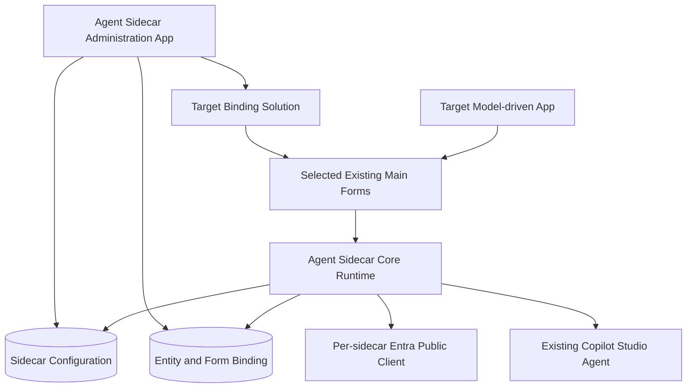

# Reusable Agent Sidecar Platform — Implementation Plan

## Objective

Turn the proven HR Agent Sidecar into a reusable Dataverse capability that an administrator can bind to unrelated Model-driven Apps, existing tables, existing main forms, and an existing Copilot Studio agent without rebuilding the runtime.

The existing HR deployment remains the reference implementation and migration test. Productization must preserve delegated user identity, user-scoped authorization, persistent conversation state, live page context, and the current accessible side-pane experience.

> **Deployment status (2026-07-10):** The project owner authorized an in-place update of the existing `HRAgentSidecar` development solution. The app-keyed compatibility runtime and active form OnLoad registrations are deployed and published in `carremacodeapps`. Future platform phases remain subject to the normal target-environment confirmation gate.

## Implementation status

- **Phase 0 baseline:** complete. Existing model-driven behavior is covered by six structural tests, and maintained web resources are checked against solution projections.
- **Phase 1 vertical slice:** deployed to the existing HR development solution. The runtime has a generic asynchronous configuration-repository contract, resolves exactly one enabled configuration by app ID, fails closed for invalid/missing/duplicate app bindings, maps entities through configuration, sends the accepted minimal context, and keeps MSAL tokens in memory.
- **Current compatibility bridge:** the repository is backed by a static HR bootstrap catalog until a discovered and approved Dataverse configuration model is available. This preserves one deterministic local build without treating build-time configuration as the final architecture.
- **Environment status:** forced-overwrite import `7ccca718-9a7c-f111-ab0e-000d3a340afd` deployed the productized runtime; import `7558cacf-9c7c-f111-ab0e-000d3a340afd` activated all seven form OnLoad events. Both imports and their publish operations completed successfully, and Dataverse/browser read-back passed.

## Accepted product contract

| Area | Decision |
|---|---|
| Packaging | Managed Agent Sidecar Core plus one Target Binding solution per Model-driven App |
| Multiplicity | Multiple independent sidecars per Dataverse environment, keyed by Model-driven App ID |
| Administration | Dedicated Agent Sidecar Administration Model-driven App in the core solution |
| Access | Packaged Agent Sidecar Administrator security role |
| Binding lifecycle | Install, update, validate, disable, and uninstall |
| Form strategy | Patch selected existing forms in place and preserve unrelated XML |
| ALM | Create an unmanaged Target Binding solution in development; export managed for downstream environments |
| Agent | Select and validate an existing Copilot Studio agent |
| Entra identity | Separate public-client app registration for each sidecar configuration |
| Promotion | Promote structural bindings; complete environment-specific setup after import |
| Knowledge | Outside installer scope and independently governed |
| Context | App identity, page type, entity logical name, record ID, and primary record name only |

## Target architecture

## Solution boundaries

### Agent Sidecar Core managed solution

The core contains:

- Generic side-pane launcher and stable runtime web resources.
- Authentication redirect bridge.
- Delegated MSAL authorization-code-with-PKCE flow.
- Microsoft 365 Agents SDK and Bot Framework Web Chat integration.
- Live page-context synchronization and trusted `pvaSetContext` envelope.
- Persistent conversation and **New conversation** behavior.
- Generic icon, styling, accessibility, and telemetry-safe error handling.
- Sidecar Configuration and Binding configuration schema.
- Agent Sidecar Administration Model-driven App.
- Agent Sidecar Administrator security role.
- Validation and lifecycle operations.

The core excludes:

- HR tables, choices, relationships, forms, app module, and sitemap.
- HR-specific entity allowlists, labels, and knowledge manifests.
- Target Copilot Studio agents and knowledge sources.
- Target-specific Entra registration values.
- The superseded Direct Line token broker and rollback Secure Configuration.

### Target Binding solution

Each binding solution contains or references:

- One target Model-driven App.
- Selected existing entities and main forms.
- Sidecar-owned form-library and OnLoad registrations.
- Structural entity-to-screen mappings.
- App-specific pane identity, title, width, and optional icon.
- Core-solution dependencies.
- Deployable binding configuration that is safe to promote unchanged.

It does not own the target business schema unless that schema is intentionally delivered by the same project.

## Configuration model

The implementation should first discover existing reusable Dataverse assets. If no suitable platform table exists, provision these core-owned tables.

### Sidecar Configuration

One record represents one configured target Model-driven App.

Required properties:

- Configuration name.
- Model-driven App ID and unique name.
- Stable pane ID derived from the configuration identity.
- Pane title, width, icon, and enabled state.
- Tenant ID and public-client Application ID.
- Power Platform environment ID.
- Existing Copilot Studio agent schema name.
- Target Binding solution unique name.
- Lifecycle state and last validation result.

The Model-driven App ID must be alternate-key unique so two configurations cannot claim the same app accidentally.

### Entity and Form Binding

One record represents an enabled entity/form pair for a Sidecar Configuration.

Required properties:

- Parent configuration.
- Entity logical name and display label.
- Main form ID and form name.
- Enabled state.
- Sidecar handler unique ID.
- Original form fingerprint captured before mutation.
- Last applied fingerprint and validation status.

The configuration tables store identifiers and mappings, not access tokens, client secrets, connector credentials, or business-record payloads.

## Administrator experience

The administration app should use a guided, resumable workflow:

1. **Select application** — discover Model-driven Apps and prevent duplicate bindings.
2. **Select entities** — show only entities present in the selected app.
3. **Select forms** — discover eligible active main forms and display existing sidecar status.
4. **Configure pane** — set title, width, icon, and stable pane identity.
5. **Configure identity** — capture the separate Entra public-client Application ID and tenant ID; show the exact redirect URI and delegated permission checklist.
6. **Select agent** — discover or accept the schema name of an existing Copilot Studio agent and validate environment, publication, authentication, sharing, and context compatibility.
7. **Review changes** — show the exact forms and solution components that will change.
8. **Apply** — create/update the binding solution, patch forms, publish, and verify read-back.
9. **Validate** — run configuration, form, agent, and runtime readiness checks.

The user must have the packaged administrator role plus the platform privileges required to customize forms, manage solutions, and publish customizations.

## Safe form mutation contract

Form mutation is the highest-risk operation and must be deterministic.

- Read the current `systemform.formxml` immediately before applying a change.
- Parse XML structurally; never use string replacement.
- Preserve all unrelated nodes, ordering, libraries, handlers, parameters, and IDs.
- Add the core launcher library only when absent.
- Add one handler with a deterministic sidecar-owned unique ID only when absent.
- Keep `passExecutionContext` enabled.
- Treat a repeated apply as a no-op.
- Record ownership and before/after fingerprints in the binding record.
- Publish and then read the live form XML back to verify persistence.
- Abort on concurrent drift rather than overwriting a form changed since review.

Disablement should turn off the binding without deleting configuration. Uninstall should remove only the handler and library reference owned by that binding; the library may be removed only when no remaining form handler uses it.

## Runtime configuration resolution

The generic launcher should derive the current Model-driven App ID at runtime and resolve exactly one enabled Sidecar Configuration. It should then validate the current entity/form against enabled bindings before creating the pane.

The runtime must fail closed:

- No configuration: do not create a pane.
- Duplicate configuration: do not choose one arbitrarily.
- Unsupported entity or form: do not create a pane.
- Disabled or incomplete configuration: do not connect to the agent.
- Invalid agent or identity settings: show an actionable, non-sensitive error.

Configuration may be cached for the browser session, but updates must support explicit invalidation and must not require rebuilding the core bundle.

## Minimal context contract

Before every outbound user message, resolve fresh host context and send only:

- Model-driven App ID or stable app identity.
- Page type.
- Entity logical name.
- Normalized record ID when present.
- Primary record name when the authoritative entity and record ID match the live form context.

Do not send arbitrary form controls, field values, hidden columns, related records, connector payloads, access tokens, or knowledge content. The record ID is a pointer and never an authorization grant.

## Agent validation contract

Onboarding uses an existing Copilot Studio agent. Validation should distinguish what can be verified automatically from what requires administrator confirmation.

Validate or report:

- Agent schema name resolves in the target environment.
- Agent is published.
- Agent uses the expected Microsoft authentication mode.
- Intended users have agent access.
- The sidecar delegated permission and admin consent are configured.
- The agent accepts the documented context keys.
- Connector tools use the intended end-user or maker credential model.

Knowledge-source setup, content authoring, SharePoint upload, and publication remain outside installer scope.

## ALM and post-import behavior

### Development

1. Import the managed core solution.
2. Use the administration app to create an unmanaged Target Binding solution.
3. Configure the target app, entities, forms, identity, and existing agent.
4. Apply, publish, verify read-back, and run acceptance tests.
5. Export the Target Binding solution as managed for downstream environments.

### Test and production

1. Import the compatible managed core version.
2. Import the managed Target Binding solution.
3. Open post-import setup.
4. Supply the destination environment's separate Entra Application ID, tenant ID, environment ID, and existing agent schema name.
5. Validate permissions, publication, sharing, form registrations, and runtime connection.
6. Enable the configuration only after validation succeeds.

Structural entity and form mappings move through the solution. Environment-specific identity and agent values must not silently retain development values.

## Delivery phases

### Phase 0 — Baseline and extraction safety

- Freeze the current HR behavior with tests and Dataverse read-back fixtures.
- Inventory every HR-specific literal and component dependency.
- Remove the superseded Direct Line rollback components from the future core boundary.
- Define version compatibility between core and binding solutions.

**Exit:** Existing HR sidecar tests prove behavioral parity before refactoring.

### Phase 1 — Generic runtime

- [ ] Rename generic namespaces and remove HR-specific constants from maintained runtime source.
- [x] Add app-keyed configuration resolution with fail-closed semantics.
- [x] Replace the HTML runtime's static entity allowlist and screen-name map with bindings.
- [x] Preserve delegated identity, context refresh, persistent pane, and conversation reset.
- [ ] Replace the compatibility bootstrap catalog with the runtime configuration repository.
- [x] Make the form launcher resolve pane and entity settings from the same configuration source.
- [x] Prove the repository can resolve two unrelated app configurations with independent pane and agent settings.
- [ ] Validate both configurations at runtime after environment import is authorized.

**Exit:** The same runtime bundle can connect to two test configurations without rebuilding.

### Phase 2 — Core configuration and security

- Complete existing-schema discovery.
- Provision the minimum core configuration schema when reuse is not possible.
- Add alternate keys, validation rules, auditing, and least-privilege security roles.
- Ensure business users can read only the configuration necessary to launch an authorized sidecar and cannot administer it.

**Exit:** Multiple app-keyed configurations coexist without collisions or secret storage.

### Phase 3 — Administration app

- Build the dedicated Model-driven App and guided configuration workflow.
- Implement app/entity/form discovery.
- Implement pane, identity, and existing-agent configuration.
- Add review, validation, status, and remediation experiences.

**Exit:** An administrator can define a valid binding without editing source files.

### Phase 4 — Binding lifecycle engine

- Create and update dedicated Target Binding solutions.
- Implement concurrency-safe, idempotent form XML patching.
- Publish and verify form metadata through Dataverse read-back.
- Implement disable and safe uninstall using ownership markers.

**Exit:** Install/update/uninstall round trips leave unrelated form XML byte-for-byte or structurally equivalent.

### Phase 5 — ALM and post-import setup

- Separate promotable structural data from destination-specific values.
- Add post-import readiness detection and setup workflow.
- Validate core/binding version compatibility.
- Document managed export and promotion procedures.

**Exit:** A binding created in development can be imported and safely completed in a different environment.

### Phase 6 — HR migration and acceptance

- Migrate HR Management into the generic core plus an HR Target Binding.
- Confirm all seven current HR forms remain enabled.
- Verify existing conversation persistence, record-name synchronization, custom icon, and context behavior.
- Test with a maker and a non-maker user, including user-authenticated agent connectors.

**Exit:** The HR implementation has no behavioral regression and no HR dependency remains in the core.

## Required test coverage

- Configuration resolution for zero, one, duplicate, disabled, and incomplete configurations.
- Multiple Model-driven Apps using different agents and pane IDs in one environment.
- Idempotent form patch and uninstall behavior.
- Preservation of unrelated form libraries and handlers.
- Concurrent-form-change detection.
- Managed core upgrade with existing binding solutions.
- Post-import prevention of development identity leakage.
- Minimal context-envelope assertions before every message.
- Navigation, new-conversation, auth-popup, and token-memory behavior.
- Non-maker authorization, agent sharing, SharePoint trimming, and connector Connect-card behavior.

## Explicit non-goals

- Creating Copilot Studio agents.
- Authoring, uploading, or publishing agent knowledge.
- Creating or modifying target business tables.
- Sending arbitrary target record fields to the agent.
- Storing secrets or user access tokens.
- Bypassing target Dataverse, Copilot Studio, SharePoint, or connector authorization.

## First implementation milestone

The first vertical slice should extract the generic runtime and migrate only the existing HR Management app into one app-keyed configuration while preserving all current behavior. Once that passes, configure a second test Model-driven App with unrelated entities and a different existing agent in the same environment. That second binding is the proof that the product boundary is genuinely reusable.
